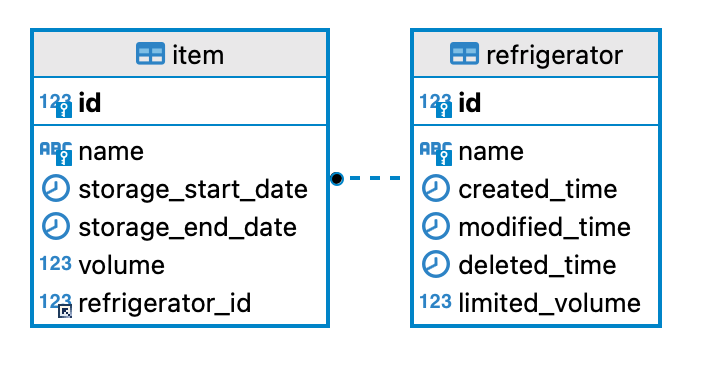

# my-refrigerator
[F-Lab] - 냉장고 관리 프로젝트 ( 손현호 )

### 개요

---
- 미니 냉장고 상품관리 시스템 

### 기술 스택

---
- MySQL
- JAVA11
- Lombok
- MyBatis
- BeanValidation
- Docker (Compose)
- FlyWayDB

### 목표

---
- MyBatis 사용방법 학습
- Join을 활용한 조회로직 작성

### ERD

### 실행 방법
1. docker-compose 폴더로 이동하여 `docker-compose up refrigerator -d`
2. Spring Boot 실행시 테이블 자동생성

### 이슈
- #7 ( [59c0d24](https://github.com/f-lab-edu/my-refrigerator/commit/59c0d2475c162e728c8219abcc8f70eb10c9f897) ) : 직렬화 실패 예외
